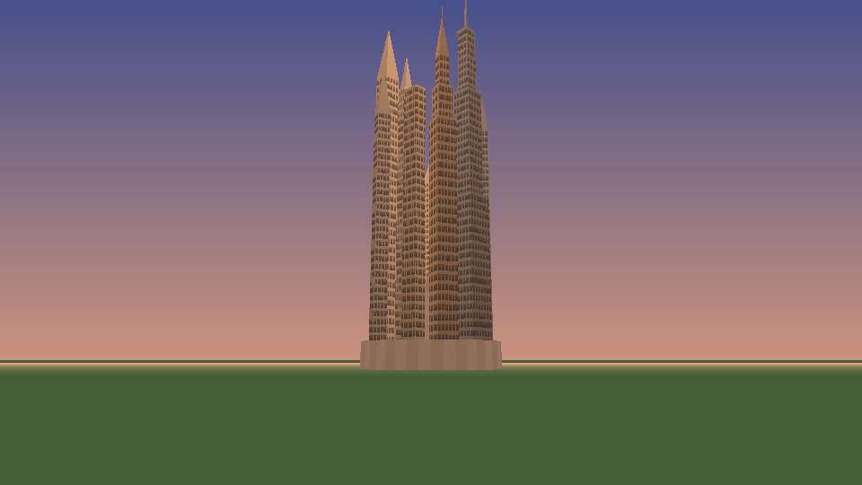
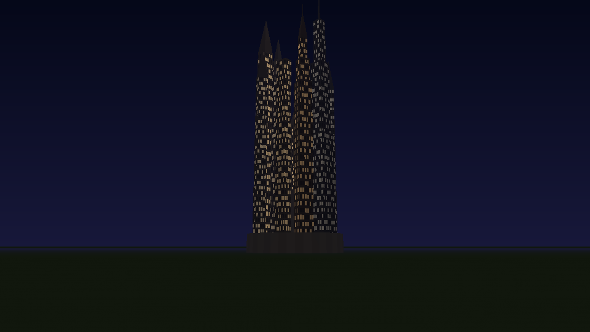
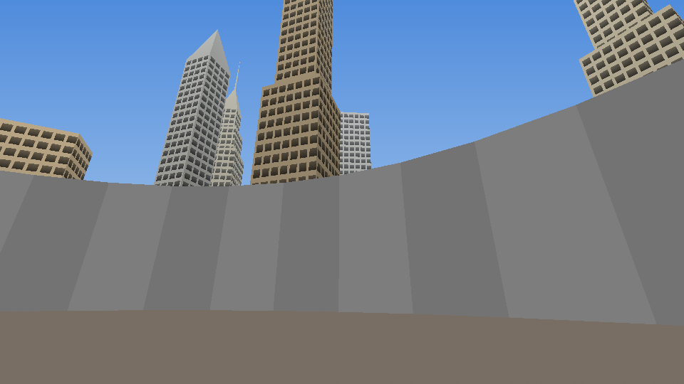

# Custom Models Pipeline

Majora City needs a lot of new geometry: skyscrapers, billboards, MCPD uniforms, new masks, and eventually whole
districts. Two pipelines cover it.

## 1. Procedural models (in-overlay)

**Use for:** repeated architecture, simple props, anything that can be described by parameters.

The skyline is the reference implementation:

- `tools/gen_skyline.py` builds tower archetypes from parameter lists (tiers, crowns, spires) and writes N64
  vertex arrays, display lists, a 32×32 I8 window texture (day and night variants) and placement layouts into
  `mod/src/overlays/actors/ovl_Mc_Skyline/mc_skyline_data.inc.c`.
- The data lives in the actor overlay itself, so it needs **no object file**, no object-table entry, and no
  loading.
- Lighting is baked into vertex colours (lighting off), so each tower costs one matrix and one display list call.
- `tools/preview_skyline.py` renders the *generated C* in software: it rebuilds the triangles from the
  `gsSPVertex`/`gsSP2Triangles` commands, applies back-face culling, the textures, vertex shading and fog.
  Broken winding, bad UVs or overflowing vertex batches are visible in the picture before you ever boot an emulator.

```bash
python3 tools/gen_skyline.py        # regenerate (deterministic)
python3 tools/preview_skyline.py    # docs/images/skyline_*.png
```

| Termina Field, dawn | Termina Field, night | South Clock Town, day |
|---|---|---|
|  |  |  |

*(Grey walls and the Clock Tower in these previews are rough stand-ins for context; the real ones come from
the player's ROM.)*

## 2. Authored models (Blender → object files)

**Use for:** characters, masks, landmark buildings with interiors, anything hand-crafted.

### Tools
- **Blender** (3.6 LTS or 4.x) with **[Fast64](https://github.com/Fast-64/fast64)**, the community N64 exporter. Its
  Zelda 64 mode exports display lists, skeletons, animations, and collision in decomp C format. Majora's Mask uses
  the same F3DZEX2 microcode and very similar object formats to Ocarina of Time. Check Fast64's documentation for
  the current state of its MM-specific scene export.
- An N64-accurate emulator for testing: **Ares** (preferred), or Mupen64Plus with ParaLLEl-RDP.

### Steps
1. **Model** in Blender at game scale: 1 Blender unit = 1 game unit after Fast64's scale setting. Link is about 50 units tall.
2. **Materials:** use Fast64's F3D materials. Prefer CI4/CI8/I4/IA8 textures at 32×32 or 64×32 (TMEM is 4 KB),
   and vertex colours for shading on architecture.
3. **Export** as C into `mod/assets/objects/object_mc_<name>/` (DLs, textures as `.inc.c`, skeleton, collision).
4. **Register the object:** a patch adding `DEFINE_OBJECT(object_mc_<name>, OBJECT_MC_<NAME>)` to
   `include/tables/object_table.h` and a matching segment in `spec`. New objects are appended, never inserted.
5. **Use it** from an actor: set the profile's object ID to `OBJECT_MC_<NAME>`, and the engine loads it before
   the actor initialises.
6. `tools/check.sh --ido`, then `./majora-city build`, then test in the emulator.

### Budgets & style
| Thing | Triangle budget | Texture budget |
|---|---|---|
| NPC (full body) | 400–700 | 4–6 textures, ≤ 64×64 each |
| Mask (held/worn) | 60–150 | 1–2 textures |
| Prop / billboard | 20–120 | 1 texture |
| Landmark tower (exterior) | 150–400 | 2–3 shared textures |
| Room in a new district | 2,000–4,000 visible | per-room texture set ≤ 40 KB |

**Style:** keep Majora's Mask's look. Use chunky, readable silhouettes, warm vertex-colour gradients, and
saturated accents. Neon signage uses additive XLU materials with an environment-colour pulse at night. Art Deco
setbacks, crowns and spires should echo the procedural skyline, so authored landmarks sit naturally among the
generated towers.

## Replacing vanilla looks (e.g. MCPD uniforms)

Vanilla assets come from the player's ROM, so we can't ship edited copies. Instead:
- **New object, same skeleton:** export a recoloured or retextured variant as a new `object_mc_*`. A small
  actor patch chooses the new object (e.g. the guard actor with a Majora City param).
- **Runtime texture swap:** many vanilla models read textures through segments (eyes, mouths, some clothing).
  An actor can point that segment (`gSPSegment`) at an original Majora City texture before drawing.

## Rules
- Only original work. No rips from other games, no traced Nintendo art, no AI images of copyrighted characters.
- Every authored asset is committed with its `.blend` source under `art/` (from M5), so anyone can re-export it.
